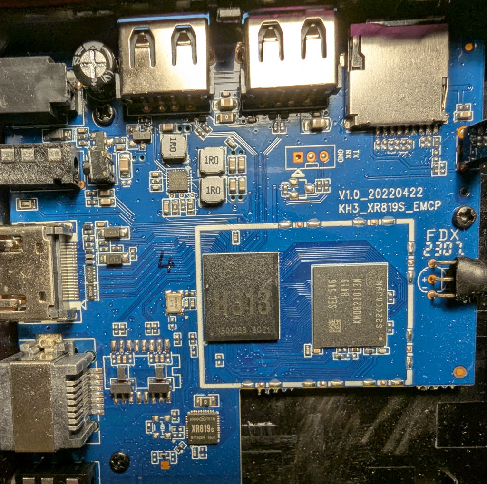
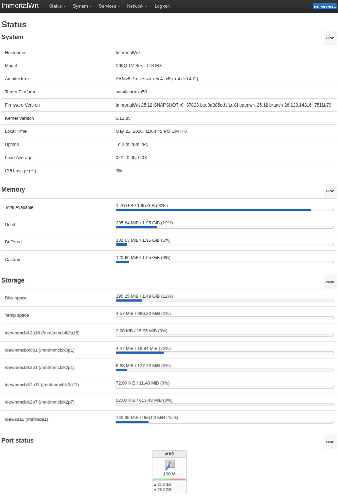

# X96Q-ImmortalWrt-Custom

A custom ImmortalWrt firmware build for the X96Q TV Box (Allwinner H313).

## 📸 Media


<div align="center">
  <h3>Board Layout</h3>
  
  
  <br><br>

  <h3>Web Interface (LuCI)</h3>
  
</div>


## ✨ Features
- **Base System:** ImmortalWrt 25.12.
- **Kernel & Bootloader**: Patched with Armbian patches from [sicXnull/armbian-build](https://github.com/sicXnull/armbian-build) for X96Q support.
- **Pre-installed Packages**: Default + [configs/my_packages.txt](./configs/my_packages.txt)
- **Local Build**: Standalone `local_build.sh` script included.

## ⚠️ Known Issues / Status
- **Wi-Fi**: Not working. Internal wireless drivers are currently not supported in this build. Use a USB Ethernet adapter or the built-in Ethernet port for connectivity.

## 📋 Prerequisites

Before starting the build, ensure your environment meets the following requirements:
* **Operating System**: Linux (x86_64 recommended)
* **Software**: [Docker](https://www.docker.com/) installed and running
* **Build Script**: The process is managed by(./local_build.sh)

## ☁️ Automated Build (GitHub Actions)

In addition to local builds, this repository supports automated compilation via GitHub Actions. This allows you to build the firmware in the cloud without local setup.

### How to use:
1. **Fork** this repository to your own GitHub account.
2. Navigate to the **Actions** tab in your forked repo.
3. Select the **Build and Release ImmortalWrt** workflow (or your specific workflow name).
4. Click the **Run workflow** button.
5. Once the process is complete, you can download the compiled binaries from the **Artifacts** section of the workflow run.


## 📜 Boot Log
For developers and advanced users, here is the initial serial output from the bootloader and kernel:

<details>
  <summary>Click to expand Boot Log</summary>

```text
[U-Boot SPL 2025.01-ImmortalWrt-r0+37823-bce0a385ed (May 11 2026 - 07:04:47 +0000)
DRAM: 2048 MiB
Trying to boot from MMC1
NOTICE:  BL31: v2.10.0  (release):ImmortalWrt v2.10-1 (sunxi-h616)
NOTICE:  BL31: Built : 07:04:47, May 11 2026
NOTICE:  BL31: Detected Allwinner H616 SoC (1823)
NOTICE:  BL31: Found U-Boot DTB at 0x4a0b0a00, model: hechuang,x96-q LPDDR3 v1.3
ERROR:   RSB: set run-time address: 0x10003


U-Boot 2025.01-ImmortalWrt-r0+37823-bce0a385ed (May 11 2026 - 07:04:47 +0000) Allwinner Technology

CPU:   Allwinner H616 (SUN50I)
Model: hechuang,x96-q LPDDR3 v1.3
DRAM:  2 GiB
Core:  59 devices, 20 uclasses, devicetree: separate
WDT:   Not starting watchdog@30090a0
MMC:   mmc@4020000: 0, mmc@4021000: 3, mmc@4022000: 1
Loading Environment from FAT... Unable to read "uboot.env" from mmc0:1... 
In:    serial@5000000
Out:   serial@5000000
Err:   serial@5000000
No USB device found
Net:   eth0: ethernet@5030000
starting USB...
No USB controllers found
Hit any key to stop autoboot:  0 
switch to partitions #0, OK
mmc0 is current device
Scanning mmc 0:1...
Found U-Boot script /boot.scr
375 bytes read in 1 ms (366.2 KiB/s)
## Executing script at 4fc00000
4689308 bytes read in 389 ms (11.5 MiB/s)
## Loading kernel from FIT Image at 44000000 ...
   Using 'config-1' configuration
   Trying 'kernel-1' kernel subimage
     Description:  ARM64 OpenWrt Linux-6.12.85
     Type:         Kernel Image
     Compression:  lzma compressed
     Data Start:   0x440000e8
     Data Size:    4657958 Bytes = 4.4 MiB
     Architecture: AArch64
     OS:           Linux
     Load Address: 0x40080000
     Entry Point:  0x40080000
     Hash algo:    crc32
     Hash value:   153ff5e5
     Hash algo:    sha1
     Hash value:   d832fef0b0f6452ed976b250d09e9374d2faa2b6
   Verifying Hash Integrity ... crc32+ sha1+ OK
## Loading fdt from FIT Image at 44000000 ...
   Using 'config-1' configuration
   Trying 'fdt-1' fdt subimage
     Description:  ARM64 OpenWrt x96q device tree blob
     Type:         Flat Device Tree
     Compression:  uncompressed
     Data Start:   0x44471544
     Data Size:    29979 Bytes = 29.3 KiB
     Architecture: AArch64
     Hash algo:    crc32
     Hash value:   196bd1ad
     Hash algo:    sha1
     Hash value:   6e818c12b68ebe062315fff3239caff4dcf3943f
   Verifying Hash Integrity ... crc32+ sha1+ OK
   Booting using the fdt blob at 0x44471544
Working FDT set to 44471544
   Uncompressing Kernel Image to 40080000
Moving Image from 0x40080000 to 0x40200000, end=0x41000000
   Loading Device Tree to 0000000049ff5000, end 0000000049fff51a ... OK
Working FDT set to 49ff5000

Starting kernel ...

[�r������] Booting Linux on physical CPU 0x0000000000 [0x410fd034]
[    0.000000] Linux version 6.12.85 (build@89385f491baa) (aarch64-openwrt-linux-musl-gcc (OpenWrt GCC 14.3.0 r0+37823-bce0a385ed)6
[    0.000000] Machine model: X96Q TV-Box LPDDR3
[    0.000000] OF: reserved mem: 0x0000000040000000..0x000000004007ffff (512 KiB) nomap non-reusable secmon@40000000
[    0.000000] Zone ranges:
[    0.000000]   DMA      [mem 0x0000000040000000-0x00000000bfffffff]
[    0.000000]   DMA32    empty
[    0.000000]   Normal   empty
[    0.000000] Movable zone start for each node
[    0.000000] Early memory node ranges
[    0.000000]   node   0: [mem 0x0000000040000000-0x000000004007ffff]
[    0.000000]   node   0: [mem 0x0000000040080000-0x00000000bfffffff]
[    0.000000] Initmem setup node 0 [mem 0x0000000040000000-0x00000000bfffffff]
[    0.000000] psci: probing for conduit method from DT.
[    0.000000] psci: PSCIv1.1 detected in firmware.
[    0.000000] psci: Using standard PSCI v0.2 function IDs
[    0.000000] psci: MIGRATE_INFO_TYPE not supported.
[    0.000000] psci: SMC Calling Convention v1.4
[    0.000000] percpu: Embedded 20 pages/cpu s43672 r8192 d30056 u81920
[    0.000000] Detected VIPT I-cache on CPU0
[    0.000000] alternatives: applying boot alternatives
[    0.000000] Kernel command line: coherent_pool=2M console=ttyS0,115200 root=PARTUUID=5452574f-02 rootwait
[    0.000000] Dentry cache hash table entries: 262144 (order: 9, 2097152 bytes, linear)
[    0.000000] Inode-cache hash table entries: 131072 (order: 8, 1048576 bytes, linear)
[    0.000000] Built 1 zonelists, mobility grouping on.  Total pages: 524288
[    0.000000] mem auto-init: stack:off, heap alloc:off, heap free:off
[    0.000000] software IO TLB: SWIOTLB bounce buffer size adjusted to 2MB
[    0.000000] software IO TLB: area num 4.
[    0.000000] software IO TLB: mapped [mem 0x00000000bd600000-0x00000000bd800000] (2MB)
[    0.000000] SLUB: HWalign=64, Order=0-3, MinObjects=0, CPUs=4, Nodes=1
[    0.000000] rcu: Hierarchical RCU implementation.
[    0.000000] rcu:     RCU restricting CPUs from NR_CPUS=8 to nr_cpu_ids=4.
[    0.000000]  Tracing variant of Tasks RCU enabled.
[    0.000000] rcu: RCU calculated value of scheduler-enlistment delay is 10 jiffies.
[    0.000000] rcu: Adjusting geometry for rcu_fanout_leaf=16, nr_cpu_ids=4
[    0.000000] RCU Tasks Trace: Setting shift to 2 and lim to 1 rcu_task_cb_adjust=1 rcu_task_cpu_ids=4.
[    0.000000] NR_IRQS: 64, nr_irqs: 64, preallocated irqs: 0
[    0.000000] Root IRQ handler: gic_handle_irq
[    0.000000] GIC: Using split EOI/Deactivate mode
[    0.000000] rcu: srcu_init: Setting srcu_struct sizes based on contention.
[    0.000000] arch_timer: cp15 timer(s) running at 24.00MHz (phys).
[    0.000000] clocksource: arch_sys_counter: mask: 0xffffffffffffff max_cycles: 0x588fe9dc0, max_idle_ns: 440795202592 ns
[    0.000001] sched_clock: 56 bits at 24MHz, resolution 41ns, wraps every 4398046511097ns
[    0.000413] Console: colour dummy device 80x25
[    0.000463] Calibrating delay loop (skipped), value calculated using timer frequency.. 48.00 BogoMIPS (lpj=240000)
[    0.000475] pid_max: default: 32768 minimum: 301
[    0.004454] Mount-cache hash table entries: 4096 (order: 3, 32768 bytes, linear)
[    0.004471] Mountpoint-cache hash table entries: 4096 (order: 3, 32768 bytes, linear)
[    0.008704] rcu: Hierarchical SRCU implementation.
[    0.008717] rcu:     Max phase no-delay instances is 1000.
[    0.008948] Timer migration: 1 hierarchy levels; 8 children per group; 1 crossnode level
[    0.009108] dyndbg: Ignore empty _ddebug table in a CONFIG_DYNAMIC_DEBUG_CORE build
[    0.009356] smp: Bringing up secondary CPUs ...
[    0.009876] Detected VIPT I-cache on CPU1
[    0.010014] CPU1: Booted secondary processor 0x0000000001 [0x410fd034]
[    0.010713] Detected VIPT I-cache on CPU2
[    0.010827] CPU2: Booted secondary processor 0x0000000002 [0x410fd034]
[    0.011476] Detected VIPT I-cache on CPU3
[    0.011585] CPU3: Booted secondary processor 0x0000000003 [0x410fd034]
[    0.011703] smp: Brought up 1 node, 4 CPUs
[    0.011711] SMP: Total of 4 processors activated.
[    0.011714] CPU: All CPU(s) started at EL2
[    0.011718] CPU features: detected: 32-bit EL0 Support
[    0.011722] CPU features: detected: CRC32 instructions
[    0.011770] alternatives: applying system-wide alternatives
[    0.011989] CPU features: emulated: Privileged Access Never (PAN) using TTBR0_EL1 switching
[    0.012758] Memory: 2036224K/2097152K available (9088K kernel code, 1172K rwdata, 3068K rodata, 512K init, 324K bss, 57444K res)
[    0.019042] clocksource: jiffies: mask: 0xffffffff max_cycles: 0xffffffff, max_idle_ns: 19112604462750000 ns
[    0.019073] futex hash table entries: 1024 (order: 4, 65536 bytes, linear)
[    0.019200] 29184 pages in range for non-PLT usage
[    0.019204] 520704 pages in range for PLT usage
[    0.021212] pinctrl core: initialized pinctrl subsystem
[    0.025014] NET: Registered PF_NETLINK/PF_ROUTE protocol family
[    0.025853] DMA: preallocated 2048 KiB GFP_KERNEL pool for atomic allocations
[    0.026134] DMA: preallocated 2048 KiB GFP_KERNEL|GFP_DMA pool for atomic allocations
[    0.026384] DMA: preallocated 2048 KiB GFP_KERNEL|GFP_DMA32 pool for atomic allocations
[    0.026873] thermal_sys: Registered thermal governor 'step_wise'
[    0.027010] ASID allocator initialised with 65536 entries
[    0.030821] /soc/bus@1000000/mixer@100000: Fixed dependency cycle(s) with /soc/tcon-top@6510000
[    0.030887] /soc/clock@3001000: Fixed dependency cycle(s) with /soc/rtc@7000000
[    0.030926] /soc/interrupt-controller@3021000: Fixed dependency cycle(s) with /soc/interrupt-controller@3021000
[    0.031193] /soc/hdmi@6000000: Fixed dependency cycle(s) with /soc/tcon-top@6510000
[    0.031226] /soc/tcon-top@6510000: Fixed dependency cycle(s) with /soc/hdmi@6000000
[    0.031239] /soc/tcon-top@6510000: Fixed dependency cycle(s) with /soc/lcd-controller@6515000
[    0.031252] /soc/tcon-top@6510000: Fixed dependency cycle(s) with /soc/bus@1000000/mixer@100000
[    0.031289] /soc/lcd-controller@6515000: Fixed dependency cycle(s) with /soc/tcon-top@6510000
[    0.031308] /soc/rtc@7000000: Fixed dependency cycle(s) with /soc/clock@3001000
[    0.031319] /soc/rtc@7000000: Fixed dependency cycle(s) with /soc/clock@7010000
[    0.031331] /soc/clock@7010000: Fixed dependency cycle(s) with /soc/clock@3001000
[    0.031342] /soc/clock@7010000: Fixed dependency cycle(s) with /soc/rtc@7000000
[    0.031605] /soc/bus@1000000/mixer@100000: Fixed dependency cycle(s) with /soc/tcon-top@6510000
[    0.032288] /soc/clock@3001000: Fixed dependency cycle(s) with /soc/rtc@7000000
[    0.036498] /soc/hdmi@6000000: Fixed dependency cycle(s) with /soc/tcon-top@6510000
[    0.036867] /soc/hdmi@6000000: Fixed dependency cycle(s) with /soc/tcon-top@6510000
[    0.036937] /soc/bus@1000000/mixer@100000: Fixed dependency cycle(s) with /soc/tcon-top@6510000
[    0.036991] /soc/tcon-top@6510000: Fixed dependency cycle(s) with /soc/hdmi@6000000
[    0.037055] /soc/tcon-top@6510000: Fixed dependency cycle(s) with /soc/lcd-controller@6515000
[    0.037068] /soc/tcon-top@6510000: Fixed dependency cycle(s) with /soc/bus@1000000/mixer@100000
[    0.037220] /soc/tcon-top@6510000: Fixed dependency cycle(s) with /soc/lcd-controller@6515000
[    0.037279] /soc/lcd-controller@6515000: Fixed dependency cycle(s) with /soc/tcon-top@6510000
[    0.037537] /soc/rtc@7000000: Fixed dependency cycle(s) with /soc/clock@7010000
[    0.037626] /soc/rtc@7000000: Fixed dependency cycle(s) with /soc/clock@7010000
[    0.037744] /soc/clock@7010000: Fixed dependency cycle(s) with /soc/rtc@7000000
[    0.038848] /soc/hdmi@6000000: Fixed dependency cycle(s) with /connector
[    0.038911] /connector: Fixed dependency cycle(s) with /soc/hdmi@6000000
[    0.055036] cryptd: max_cpu_qlen set to 1000
[    0.059306] SCSI subsystem initialized
[    0.059852] usbcore: registered new interface driver usbfs
[    0.059898] usbcore: registered new interface driver hub
[    0.059943] usbcore: registered new device driver usb
[    0.060304] pps_core: LinuxPPS API ver. 1 registered
[    0.060309] pps_core: Software ver. 5.3.6 - Copyright 2005-2007 Rodolfo Giometti <giometti@linux.it>
[    0.060337] PTP clock support registered
[    0.060623] Advanced Linux Sound Architecture Driver Initialized.
[    0.061743] clocksource: Switched to clocksource arch_sys_counter
[    0.068025] NET: Registered PF_INET protocol family
[    0.068242] IP idents hash table entries: 32768 (order: 6, 262144 bytes, linear)
[    0.071123] tcp_listen_portaddr_hash hash table entries: 1024 (order: 2, 16384 bytes, linear)
[    0.071169] Table-perturb hash table entries: 65536 (order: 6, 262144 bytes, linear)
[    0.071183] TCP established hash table entries: 16384 (order: 5, 131072 bytes, linear)
[    0.071314] TCP bind hash table entries: 16384 (order: 7, 524288 bytes, linear)
[    0.072004] TCP: Hash tables configured (established 16384 bind 16384)
[    0.072447] MPTCP token hash table entries: 2048 (order: 4, 49152 bytes, linear)
[    0.072657] UDP hash table entries: 1024 (order: 3, 32768 bytes, linear)
[    0.072710] UDP-Lite hash table entries: 1024 (order: 3, 32768 bytes, linear)
[    0.073170] NET: Registered PF_UNIX/PF_LOCAL protocol family
[    0.075659] workingset: timestamp_bits=46 max_order=19 bucket_order=0
[    0.083470] squashfs: version 4.0 (2009/01/31) Phillip Lougher
[    0.084175] jffs2: version 2.2 (NAND) (SUMMARY) (LZMA) (RTIME) (CMODE_PRIORITY) (c) 2001-2006 Red Hat, Inc.
[    0.094900] gpio gpiochip0: Static allocation of GPIO base is deprecated, use dynamic allocation.
[    0.097584] gpio gpiochip0: Static allocation of GPIO base is deprecated, use dynamic allocation.
[    0.099839] ledtrig-cpu: registered to indicate activity on CPUs
[    0.112008] Serial: 8250/16550 driver, 8 ports, IRQ sharing disabled
[    0.116961] misc dump reg init
[    0.124737] loop: module loaded
[    0.128879] usbcore: registered new interface driver usb-storage
[    0.129400] mousedev: PS/2 mouse device common for all mice
[    0.130525] sun6i-rtc 7000000.rtc: registered as rtc0
[    0.130559] sun6i-rtc 7000000.rtc: setting system clock to 2026-05-21T16:41:23 UTC (1779381683)
[    0.130929] i2c_dev: i2c /dev entries driver
[    0.133337] sunxi-wdt 30090a0.watchdog: Watchdog enabled (timeout=16 sec, nowayout=0)
[    0.137037] SMCCC: SOC_ID: ID = jep106:091e:1823 Revision = 0x00000000
[    0.138273] sun8i-ce 1904000.crypto: will run requests pump with realtime priority
[    0.138414] sun8i-ce 1904000.crypto: will run requests pump with realtime priority
[    0.138541] sun8i-ce 1904000.crypto: will run requests pump with realtime priority
[    0.138631] sun8i-ce 1904000.crypto: will run requests pump with realtime priority
[    0.138726] sun8i-ce 1904000.crypto: Register cbc(aes)
[    0.138780] sun8i-ce 1904000.crypto: Register ecb(aes)
[    0.138793] sun8i-ce 1904000.crypto: Register cbc(des3_ede)
[    0.138805] sun8i-ce 1904000.crypto: Register ecb(des3_ede)
[    0.138818] sun8i-ce 1904000.crypto: Register md5
[    0.138830] sun8i-ce 1904000.crypto: Register sha1
[    0.138842] sun8i-ce 1904000.crypto: Register sha224
[    0.138854] sun8i-ce 1904000.crypto: Register sha256
[    0.138880] sun8i-ce 1904000.crypto: Register sha384
[    0.138893] sun8i-ce 1904000.crypto: Register sha512
[    0.138906] sun8i-ce 1904000.crypto: Register stdrng
[    0.139038] sun8i-ce 1904000.crypto: CryptoEngine Die ID 0
[    0.140541] random: crng init done
[    0.149535] NET: Registered PF_INET6 protocol family
[    0.151002] Segment Routing with IPv6
[    0.151041] In-situ OAM (IOAM) with IPv6
[    0.151112] NET: Registered PF_PACKET protocol family
[    0.151159] can: controller area network core
[    0.151204] NET: Registered PF_CAN protocol family
[    0.151208] 8021q: 802.1Q VLAN Support v1.8
[    0.166717] alg: No test for stdrng (sun8i-ce-prng)
[    0.180709] /soc/tcon-top@6510000: Fixed dependency cycle(s) with /soc/bus@1000000/mixer@100000
[    0.180838] /soc/bus@1000000/mixer@100000: Fixed dependency cycle(s) with /soc/tcon-top@6510000
[    0.183950] gpio gpiochip0: Static allocation of GPIO base is deprecated, use dynamic allocation.
[    0.193183] sun50i-h616-pinctrl 300b000.pinctrl: initialized sunXi PIO driver
[    0.194207] gpio gpiochip1: Static allocation of GPIO base is deprecated, use dynamic allocation.
[    0.194570] sun50i-h616-r-pinctrl 7022000.pinctrl: initialized sunXi PIO driver
[    0.195022] sun50i-h616-pinctrl 300b000.pinctrl: supply vcc-ph not found, using dummy regulator
[    0.197847] printk: legacy console [ttyS0] disabled
[    0.218738] 5000000.serial: ttyS0 at MMIO 0x5000000 (irq = 290, base_baud = 1500000) is a 16550A
[    0.218816] printk: legacy console [ttyS0] enabled
[    1.359678] sun50i-h616-pinctrl 300b000.pinctrl: supply vcc-pg not found, using dummy regulator
[    1.389732] 5000400.serial: ttyS1 at MMIO 0x5000400 (irq = 291, base_baud = 1500000) is a 16550A
[    1.399371] sun50i-h616-pinctrl 300b000.pinctrl: supply vcc-pa not found, using dummy regulator
[    1.408552] gmac-power0: NULL
[    1.411537] gmac-power1: NULL
[    1.414517] gmac-power2: NULL
[    2.233317] usb_phy_generic usb_phy_generic.1.auto: dummy supplies not allowed for exclusive requests (id=vbus)
[    2.244935] sun50i-h616-r-pinctrl 7022000.pinctrl: supply vcc-pl not found, using dummy regulator
[    2.254962] axp20x-i2c 0-0036: AXP20x variant AXP313a found
[    2.260827] axp20x-i2c 0-0036: AXP20X driver loaded
[    2.265959] dw-apb-uart 5000400.serial: Failed to create device link (0x180) with 0-0036
[    2.277665] vdd-dram: Bringing 1100000uV into 1200000-1200000uV
[    2.278446] sun50i_cpufreq_nvmem: Using CPU speed bin speed4
[    2.289871] cpu cpu0: opp_parse_microvolt: opp-microvolt missing although OPP managing regulators
[    2.298828] cpu cpu0: _of_add_opp_table_v2: Failed to add OPP, -22
[    2.305053] cpu cpu0: OPP table can't be empty
[    2.313129] ehci-platform 5200000.usb: EHCI Host Controller
[    2.313195] ehci-platform 5310000.usb: EHCI Host Controller
[    2.313278] ehci-platform 5311000.usb: EHCI Host Controller
[    2.313303] ehci-platform 5311000.usb: new USB bus registered, assigned bus number 1
[    2.313447] ehci-platform 5311000.usb: irq 19, io mem 0x05311000
[    2.314427] phy phy-5100400.phy.0: Changing dr_mode to 1
[    2.314460] ohci-platform 5101400.usb: Generic Platform OHCI controller
[    2.314481] ohci-platform 5101400.usb: new USB bus registered, assigned bus number 2
[    2.314628] ohci-platform 5101400.usb: irq 20, io mem 0x05101400
[    2.315290] ohci-platform 5200400.usb: Generic Platform OHCI controller
[    2.315315] ohci-platform 5200400.usb: new USB bus registered, assigned bus number 3
[    2.315472] ohci-platform 5200400.usb: irq 21, io mem 0x05200400
[    2.316126] ohci-platform 5310400.usb: Generic Platform OHCI controller
[    2.316151] ohci-platform 5310400.usb: new USB bus registered, assigned bus number 4
[    2.316309] ohci-platform 5310400.usb: irq 22, io mem 0x05310400
[    2.317126] ohci-platform 5311400.usb: Generic Platform OHCI controller
[    2.317157] ohci-platform 5311400.usb: new USB bus registered, assigned bus number 5
[    2.317286] ohci-platform 5311400.usb: irq 23, io mem 0x05311400
[    2.318755] ehci-platform 5200000.usb: new USB bus registered, assigned bus number 6
[    2.322580] sun50i-h616-pinctrl 300b000.pinctrl: supply vcc-pf not found, using dummy regulator
[    2.324400] ehci-platform 5310000.usb: new USB bus registered, assigned bus number 7
[    2.330023] ehci-platform 5200000.usb: irq 17, io mem 0x05200000
[    2.331767] ehci-platform 5311000.usb: USB 2.0 started, EHCI 1.00
[    2.331963] usb usb1: New USB device found, idVendor=1d6b, idProduct=0002, bcdDevice= 6.12
[    2.331973] usb usb1: New USB device strings: Mfr=3, Product=2, SerialNumber=1
[    2.331981] usb usb1: Product: EHCI Host Controller
[    2.331988] usb usb1: Manufacturer: Linux 6.12.85 ehci_hcd
[    2.331994] usb usb1: SerialNumber: 5311000.usb
[    2.332598] hub 1-0:1.0: USB hub found
[    2.332772] hub 1-0:1.0: 1 port detected
[    2.333684] sun50i-h616-pinctrl 300b000.pinctrl: supply vcc-pc not found, using dummy regulator
[    2.334872] reg-fixed-voltage reg_vcc_wifi: nonexclusive access to GPIO for (default)
[    2.335533] clk: Disabling unused clocks
[    2.335730] ALSA device list:
[    2.335735]   No soundcards found.
[    2.337856] ehci-platform 5310000.usb: irq 18, io mem 0x05310000
[    2.346331] sunxi-mmc 4021000.mmc: allocated mmc-pwrseq
[    2.361754] ehci-platform 5200000.usb: USB 2.0 started, EHCI 1.00
[    2.380049] usb usb5: New USB device found, idVendor=1d6b, idProduct=0001, bcdDevice= 6.12
[    2.382066] ehci-platform 5310000.usb: USB 2.0 started, EHCI 1.00
[    2.387036] sunxi-mmc 4020000.mmc: initialized, max. request size: 16384 KB, uses new timings mode
[    2.389915] usb usb5: New USB device strings: Mfr=3, Product=2, SerialNumber=1
[    2.397314] sunxi-mmc 4022000.mmc: initialized, max. request size: 2048 KB, uses new timings mode
[    2.404275] usb usb5: Product: Generic Platform OHCI controller
[    2.404287] usb usb5: Manufacturer: Linux 6.12.85 ohci_hcd
[    2.439810] mmc0: host does not support reading read-only switch, assuming write-enable
[    2.447045] usb usb5: SerialNumber: 5311400.usb
[    2.447649] hub 5-0:1.0: USB hub found
[    2.454909] mmc0: new SD card at address db7a
[    2.460868] hub 5-0:1.0: 1 port detected
[    2.467858] mmcblk0: mmc0:db7a SU02G 1.84 GiB
[    2.476401] usb usb4: New USB device found, idVendor=1d6b, idProduct=0001, bcdDevice= 6.12
[    2.521776] ehci-platform 5101000.usb: EHCI Host Controller
[    2.525461] usb usb4: New USB device strings: Mfr=3, Product=2, SerialNumber=1
[    2.604291] sunxi-mmc 4021000.mmc: initialized, max. request size: 16384 KB, uses new timings mode
[    2.607896] usb usb4: Product: Generic Platform OHCI controller
[    2.664741] usb usb4: Manufacturer: Linux 6.12.85 ohci_hcd
[    2.670238] usb usb4: SerialNumber: 5310400.usb
[    2.675235]  mmcblk0: p1 p2
[    2.675405] hub 4-0:1.0: USB hub found
[    2.682009] hub 4-0:1.0: 1 port detected
[    2.686535] usb usb3: New USB device found, idVendor=1d6b, idProduct=0001, bcdDevice= 6.12
[    2.693601] mmc3: new high speed SDIO card at address 0001
[    2.694882] usb usb3: New USB device strings: Mfr=3, Product=2, SerialNumber=1
[    2.707552] usb usb3: Product: Generic Platform OHCI controller
[    2.713506] usb usb3: Manufacturer: Linux 6.12.85 ohci_hcd
[    2.718989] usb usb3: SerialNumber: 5200400.usb
[    2.724029] hub 3-0:1.0: USB hub found
[    2.727915] hub 3-0:1.0: 1 port detected
[    2.732482] usb usb6: New USB device found, idVendor=1d6b, idProduct=0002, bcdDevice= 6.12
[    2.740774] usb usb6: New USB device strings: Mfr=3, Product=2, SerialNumber=1
[    2.748048] usb usb6: Product: EHCI Host Controller
[    2.752971] usb usb6: Manufacturer: Linux 6.12.85 ehci_hcd
[    2.752983] mmc2: new DDR MMC card at address 0001
[    2.758452] usb usb6: SerialNumber: 5200000.usb
[    2.764179] mmcblk2: mmc2:0001 Q823MB 14.6 GiB
[    2.768425] hub 6-0:1.0: USB hub found
[    2.776123] hub 6-0:1.0: 1 port detected
[    2.780700] usb usb7: New USB device found, idVendor=1d6b, idProduct=0002, bcdDevice= 6.12
[    2.789043] usb usb7: New USB device strings: Mfr=3, Product=2, SerialNumber=1
[    2.796278] usb usb7: Product: EHCI Host Controller
[    2.801153] usb usb7: Manufacturer: Linux 6.12.85 ehci_hcd
[    2.806641] usb usb7: SerialNumber: 5310000.usb
[    2.812062] hub 7-0:1.0: USB hub found
[    2.816001] hub 7-0:1.0: 1 port detected
[    2.816056]  mmcblk2: p1 p2 p3 p4 p5 p6 p7 p8 p9 p10 p11 p12 p13 p14 p15 p16 p17
[    2.820474] usb usb2: New USB device found, idVendor=1d6b, idProduct=0001, bcdDevice= 6.12
[    2.829103] mmcblk2boot0: mmc2:0001 Q823MB 4.00 MiB
[    2.835706] usb usb2: New USB device strings: Mfr=3, Product=2, SerialNumber=1
[    2.841860] mmcblk2boot1: mmc2:0001 Q823MB 4.00 MiB
[    2.847819] usb usb2: Product: Generic Platform OHCI controller
[    2.858599] usb usb2: Manufacturer: Linux 6.12.85 ohci_hcd
[    2.864129] usb usb2: SerialNumber: 5101400.usb
[    2.869321] hub 2-0:1.0: USB hub found
[    2.873166] hub 2-0:1.0: 1 port detected
[    2.877481] ehci-platform 5101000.usb: new USB bus registered, assigned bus number 8
[    2.885423] ehci-platform 5101000.usb: irq 24, io mem 0x05101000
[    2.901750] ehci-platform 5101000.usb: USB 2.0 started, EHCI 1.00
[    2.908024] usb usb8: New USB device found, idVendor=1d6b, idProduct=0002, bcdDevice= 6.12
[    2.916317] usb usb8: New USB device strings: Mfr=3, Product=2, SerialNumber=1
[    2.923542] usb usb8: Product: EHCI Host Controller
[    2.928415] usb usb8: Manufacturer: Linux 6.12.85 ehci_hcd
[    2.933902] usb usb8: SerialNumber: 5101000.usb
[    2.938978] hub 8-0:1.0: USB hub found
[    2.942833] hub 8-0:1.0: 1 port detected
[    2.954807] VFS: Mounted root (squashfs filesystem) readonly on device 179:2.
[    2.962222] Freeing unused kernel memory: 512K
[    2.966708] Run /sbin/init as init process
[    3.200925] init: Console is alive
[    3.204648] init: - watchdog -
[    3.211787] usb 8-1: new high-speed USB device number 2 using ehci-platform
[    3.401823] usb 3-1: new full-speed USB device number 2 using ohci-platform
[    3.486541] kmodloader: loading kernel modules from /etc/modules-boot.d/*
[    3.523378] usbcore: registered new interface driver uas
[    3.529284] kmodloader: done loading kernel modules from /etc/modules-boot.d/*
[    3.541814] init: - preinit -
[    3.650833] usb 3-1: New USB device found, idVendor=045e, idProduct=0800, bcdDevice= 9.34
[    3.659095] usb 3-1: New USB device strings: Mfr=1, Product=2, SerialNumber=0
[    3.666292] usb 3-1: Product: Microsoft® Nano Transceiver v2.0
[    3.672294] usb 3-1: Manufacturer: Microsoft
Cannot parse config file '/etc/fw_env.config': No such file or directory
Failed to find NVMEM device
[    7.732374] sunxi-gmac 5030000.ethernet eth0: No PHY found!
[    7.740997] sunxi-gmac 5030000.ethernet eth0: phy init again...
[    8.371792] usb 8-1: device descriptor read/64, error -110
[    8.672604] usb 8-1: New USB device found, idVendor=abcd, idProduct=1234, bcdDevice= 1.00
[    8.680809] usb 8-1: New USB device strings: Mfr=1, Product=2, SerialNumber=3
[    8.687958] usb 8-1: Product: UDisk           
[    8.692500] usb 8-1: Manufacturer: General 
[    8.696680] usb 8-1: SerialNumber: 1311210659461041921806
[    8.703468] usb-storage 8-1:1.0: USB Mass Storage device detected
[    8.710336] scsi host0: usb-storage 8-1:1.0
[    9.762678] scsi 0:0:0:0: Direct-Access     General  UDisk            5.00 PQ: 0 ANSI: 2
[    9.823670] sd 0:0:0:0: [sda] 1968128 512-byte logical blocks: (1.01 GB/961 MiB)
[    9.831912] sd 0:0:0:0: [sda] Write Protect is off
[    9.841839] sd 0:0:0:0: [sda] No Caching mode page found
[    9.847187] sd 0:0:0:0: [sda] Assuming drive cache: write through
[    9.902899]  sda: sda1
[    9.905649] sd 0:0:0:0: [sda] Attached SCSI removable disk
[   10.481560] sunxi-gmac 5030000.ethernet eth0: eth0: Type(7) PHY ID 00441400 at 0 IRQ poll (5030000.ethernet-0:00)
Press the [f] key and hit [enter] to enter failsafe mode
Press the [1], [2], [3] or [4] key and hit [enter] to select the debug level
[   13.592325] sunxi-gmac 5030000.ethernet eth0: Link is Up - 100Mbps/Full - flow control off
[   14.622175] mount_root: loading kmods from internal overlay
[   14.637205] kmodloader: loading kernel modules from //etc/modules-boot.d/*
[   14.645324] kmodloader: done loading kernel modules from //etc/modules-boot.d/*
[   15.089384] block: attempting to load /tmp/overlay/upper/etc/config/fstab
[   15.096500] block: unable to load configuration (fstab: Entry not found)
[   15.103369] block: attempting to load /tmp/overlay/etc/config/fstab
[   15.109741] block: unable to load configuration (fstab: Entry not found)
[   15.116569] block: attempting to load /etc/config/fstab
[   15.124650] block: unable to load configuration (fstab: Entry not found)
[   15.131455] block: no usable configuration
[   15.137152] loop0: detected capacity change from 0 to 3145728
[   15.201788] loop0: detected capacity change from 3145728 to 3133056
[   15.900083] F2FS-fs (loop0): Mounted with checkpoint version = 1cbfdbd1
[   15.907021] block: attempting to load /tmp/f2fs_cfg/upper/etc/config/fstab
[   15.915991] block: extroot: not configured
[   15.943251] loop0: detected capacity change from 0 to 3145728
[   15.991750] loop0: detected capacity change from 3145728 to 3133056
[   16.004803] F2FS-fs (loop0): Mounted with checkpoint version = 1cbfdbd3
[   16.012177] mount_root: loading kmods from internal overlay
[   16.030091] kmodloader: loading kernel modules from /tmp/overlay/upper/etc/modules-boot.d/*
[   16.038999] kmodloader: done loading kernel modules from /tmp/overlay/upper/etc/modules-boot.d/*
[   16.330891] block: attempting to load /tmp/overlay/upper/etc/config/fstab
[   16.338801] block: extroot: not configured
[   16.344806] block: attempting to load /tmp/f2fs_cfg/upper/etc/config/fstab
[   16.352353] block: extroot: not configured
[   16.357995] mount_root: switching to f2fs overlay
[   16.364204] overlayfs: null uuid detected in lower fs '/', falling back to xino=off,index=off,nfs_export=off.
[   16.463941] urandom-seed: Seeding with /etc/urandom.seed
[   16.503983] sunxi-gmac 5030000.ethernet eth0: Link is Down
[   16.520593] procd: - early -
[   16.523847] procd: - watchdog -
[   17.117235] procd: - watchdog -
[   17.121061] procd: - ubus -
[   17.280695] procd: - init -
Please press Enter to activate this console.
[   17.718651] kmodloader: loading kernel modules from /etc/modules.d/*
[   17.748108] "cryptomgr_test" (1721) uses obsolete ecb(arc4) skcipher
[   17.986324] NET: Registered PF_ALG protocol family
[   17.987854] urngd: v1.0.2 started.
[   18.006909] tun: Universal TUN/TAP device driver, 1.6
[   18.025655] ntfs3: Enabled Linux POSIX ACLs support
[   18.071004] usbcore: registered new interface driver ums-alauda
[   18.079057] usbcore: registered new interface driver ums-cypress
[   18.087966] usbcore: registered new interface driver ums-datafab
[   18.096532] usbcore: registered new interface driver ums-freecom
[   18.104569] usbcore: registered new interface driver ums-isd200
[   18.113323] usbcore: registered new interface driver ums-jumpshot
[   18.121923] usbcore: registered new interface driver ums-karma
[   18.130409] usbcore: registered new interface driver ums-sddr09
[   18.138654] usbcore: registered new interface driver ums-sddr55
[   18.146162] usbcore: registered new interface driver ums-usbat
[   18.182940] nft_fullcone: loading out-of-tree module taints kernel.
[   18.211981] PPP generic driver version 2.4.2
[   18.218046] PPP MPPE Compression module registered
[   18.224334] NET: Registered PF_PPPOX protocol family
[   18.235984] kmodloader: done loading kernel modules from /etc/modules.d/*
[   19.646482] FAT-fs (mmcblk2p16): Volume was not properly unmounted. Some data may be corrupt. Please run fsck.
[   19.979836] FAT-fs (mmcblk2p1): Volume was not properly unmounted. Some data may be corrupt. Please run fsck.
[   19.996131] EXT4-fs (mmcblk2p11): mounted filesystem 6ea6d525-30c9-4a32-bc73-6bde1d79152c r/w with ordered data mode. Quota mod.
[   20.008762] ext4 filesystem being mounted at /mnt/mmcblk2p11 supports timestamps until 2038-01-19 (0x7fffffff)
[   20.022002] F2FS-fs (mmcblk2p17): Filesystem with quota feature cannot be mounted RDWR without CONFIG_QUOTA
[   20.037270] EXT4-fs (mmcblk2p7): mounted filesystem 7cf3e954-75e0-4304-95d6-e88aaf296b6b r/w with ordered data mode. Quota mode.
[   20.057733] FAT-fs (sda1): Volume was not properly unmounted. Some data may be corrupt. Please run fsck.
[   27.565890] sunxi-gmac 5030000.ethernet eth0: eth0: Type(7) PHY ID 00441400 at 0 IRQ poll (5030000.ethernet-0:00)
[   27.605239] F2FS-fs (mmcblk2p17): Filesystem with quota feature cannot be mounted RDWR without CONFIG_QUOTA
[   29.672398] sunxi-gmac 5030000.ethernet eth0: Link is Up - 100Mbps/Full - flow control off


BusyBox v1.37.0 (2026-05-11 07:04:47 UTC) built-in shell (ash)

.___                               __         .__
|   | _____   _____   ____________/  |______  |  |
|   |/     \ /     \ /  _ \_  __ \   __\__  \ |  |
|   |  Y Y  \  Y Y  (  <_> )  | \/|  |  / __ \|  |__
|___|__|_|  /__|_|  /\____/|__|   |__| (____  /____/
          \/      \/  BE FREE AND UNAFRAID  \/
 ------------------------------------------------------
 ImmortalWrt 25.12-SNAPSHOT, r0+37823-bce0a385ed Dave's Guitar
 ------------------------------------------------------

 OpenWrt recently switched to the "apk" package manager!

 OPKG Command           APK Equivalent      Description
 ------------------------------------------------------------------
 opkg install <pkg>     apk add <pkg>       Install a package
 opkg remove <pkg>      apk del <pkg>       Remove a package
 opkg upgrade           apk upgrade         Upgrade all packages
 opkg files <pkg>       apk info -L <pkg>   List package contents
 opkg list-installed    apk info            List installed packages
 opkg update            apk update          Update package lists
 opkg search <pkg>      apk search <pkg>    Search for packages
 ------------------------------------------------------------------

For more information visit:
https://openwrt.org/docs/guide-user/additional-software/opkg-to-apk-cheatsheet

root@ImmortalWrt:~# ]
```
</details>

## 🤝 Support & Acknowledgments
- Based on the [ImmortalWrt Project](https://github.com/immortalwrt/immortalwrt).
- Kernel & Bootloader: Patched with Armbian patches from [sicXnull/armbian-build](https://github.com/sicXnull/armbian-build)

---
Developed by [vlukjanenko].
